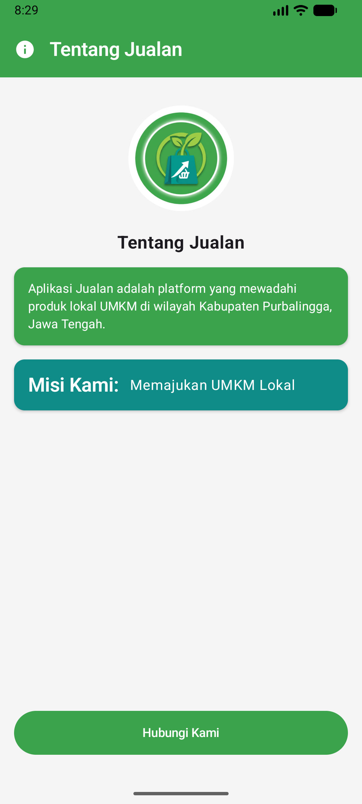
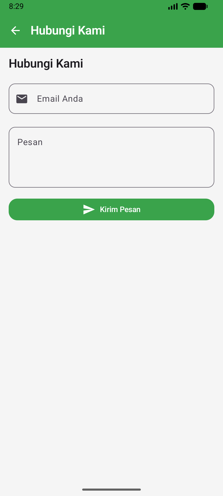
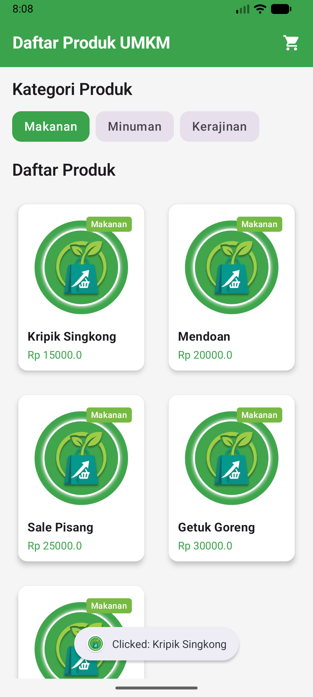
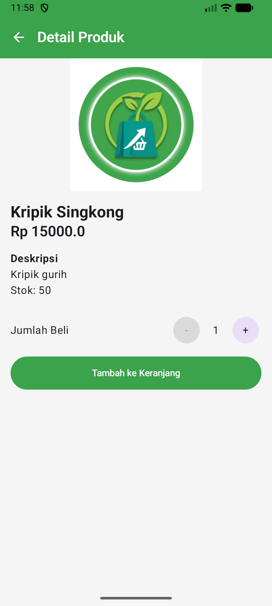
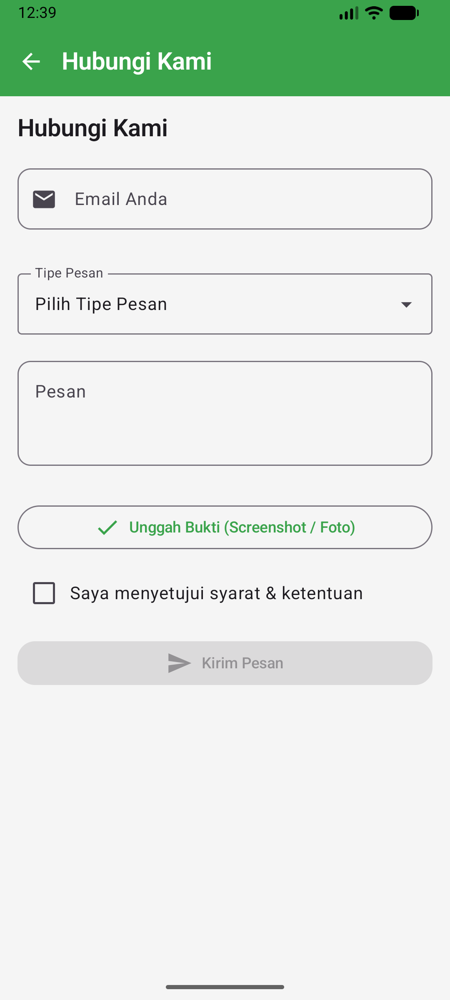

# Laporan Praktikum Pemrograman Mobile

**Nama**        : Iqsan Azhar  
**NIM**         : H1D024009  
**Shift**       : A / C  
**Praktikum**   : Pemrograman Mobile

---

## 📝 Tugas Pertemuan 1
**Tanggal**: Selasa, 1 September 2026

**Kesimpulan Praktikum:**  
Pada pertemuan pertama, praktikum memberikan pemahaman dasar mengenai konsep pengembangan aplikasi mobile. Mahasiswa dapat mengenali struktur proyek, alur kerja, serta pentingnya konsistensi dalam penulisan kode agar aplikasi mudah dikembangkan dan dipelihara.

---

## 📝 Tugas Pertemuan 2
**Tanggal**: Selasa, 8 September 2026

**Kesimpulan Praktikum:**  
Pertemuan kedua menekankan pada implementasi fitur interaktif dalam aplikasi mobile. Mahasiswa belajar bagaimana menghubungkan antarmuka dengan logika program sehingga aplikasi dapat merespons input pengguna secara dinamis dan memberikan pengalaman yang lebih baik.

---

## 📝 Tugas Pertemuan 3
**Tanggal**: Selasa, 15 September 2026

**Kesimpulan Praktikum:**  
Pertemuan ketiga membuka wawasan tentang pengembangan aplikasi mobile yang lebih kompleks. Mahasiswa belajar bagaimana mengintegrasikan berbagai komponen dan fitur untuk menciptakan aplikasi yang lebih lengkap dan bermanfaat.

---

## 📝 Tugas Pertemuan 4
**Tanggal**: Selasa, 22 September 2026

| Detail Produk | Form Hubungi Kami |
| :---: | :---: |
|  |  |

**Kesimpulan Praktikum:**  
Pertemuan keempat memfokuskan pada implementasi sistem navigasi antar-layar menggunakan Jetpack Navigation Compose serta pembuatan formulir interaktif dan halaman detail produk. Mahasiswa belajar bagaimana mengelola perpindahan rute dan pengiriman argumen (seperti `productId`), menerapkan pola arsitektur *Stateful* dan *Stateless Composable*, melakukan validasi input formulir secara dinamis, mengintegrasikan fitur pemilihan gambar (*Photo Picker*), serta menyajikan umpan balik interaktif kepada pengguna melalui *Snackbar* dan *Toast*.
